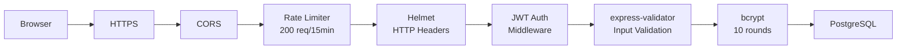

# Documentacao Tecnica - Diario de Habitos

---

## 1. Arquitetura do Sistema

### 1.1 Visao Geral

O sistema segue uma arquitetura **monolitica modular** de tres camadas (3-tier architecture), com separacao clara entre apresentacao, logica de negocio e persistencia de dados:

```
+------------------------------------------------------------------+
|                        CLIENTE (Browser)                         |
|  +------------------------------------------------------------+  |
|  |              SPA React + Vite + Tailwind CSS               |  |
|  |  +------------+ +-----------+ +----------+ +------------+  |  |
|  |  | Paginas    | | Contexto  | | Servicos | | Componentes |  |  |
|  |  | (8 paginas)| | (Auth)    | | (Axios)  | | (Layout)    |  |  |
|  |  +------------+ +-----------+ +----------+ +------------+  |  |
|  +------------------------------------------------------------+  |
+------------------------------------------------------------------+
    |  HTTP REST  (JSON, JWT em Header Authorization: Bearer)
    v
+------------------------------------------------------------------+
|                     API SERVER (Node.js + Express)                |
|  +------------------------------------------------------------+  |
|  |  Middleware Layer: Helmet | CORS | Rate Limit | Morgan     |  |
|  +------------------------------------------------------------+  |
|  |  Router Layer: /api/auth | /api/habits | /api/reminders    |  |
|  |                 /api/admin | /api/health                    |  |
|  +------------------------------------------------------------+  |
|  |  Controller Layer: Auth | Habit | Reminder | Admin         |  |
|  +------------------------------------------------------------+  |
|  |  Utils Layer: Reminder Scheduler (node-cron)               |  |
|  +------------------------------------------------------------+  |
|  |  Data Access: pg Pool (conexao PostgreSQL)                 |  |
|  +------------------------------------------------------------+  |
+------------------------------------------------------------------+
    |  TCP 5432
    v
+------------------------------------------------------------------+
|                  BASE DE DADOS (PostgreSQL 15)                    |
|  +------------------------------------------------------------+  |
|  |  Tabelas: users | habits | habit_completions | reminders   |  |
|  |  Indices: idx_habits_user_id | idx_completions_habit_id    |  |
|  |           idx_completions_user_date | idx_reminders_user_id |  |
|  +------------------------------------------------------------+  |
+------------------------------------------------------------------+
```

### 1.2 Camadas da Arquitetura

#### Camada de Apresentacao (Frontend - React SPA)

**Tecnologias:** React 18, Vite, Tailwind CSS, Recharts, React Router v6, Axios

**Estrutura de Componentes:**
```
src/
  main.jsx              -> Ponto de entrada, renderiza App
  App.jsx               -> Router principal (6 rotas publicas/privadas)
  index.css             -> Estilos globais + Tailwind
  context/
    AuthContext.jsx      -> Estado global de autenticacao (React Context)
  components/
    Layout.jsx           -> Layout padrao com navegacao lateral
  pages/
    LoginPage.jsx        -> Pagina de autenticacao
    RegisterPage.jsx     -> Registo de novos utilizadores
    DashboardPage.jsx    -> Pagina inicial apos login
    HabitsPage.jsx       -> CRUD de habitos
    StatsPage.jsx        -> Graficos e estatisticas
    RemindersPage.jsx    -> Gestao de lembretes
    AdminPage.jsx        -> Painel de administracao
    ProfilePage.jsx      -> Edicao de perfil
  services/
    api.js               -> Camada Axios com interceptors
```

**Mecanismo de Autenticacao:**

O `AuthContext` gerencia o estado global do utilizador autenticado. Quando o utilizador faz login:
1. O token JWT e armazenado no `localStorage` (chave: `hd_token`)
2. Os dados do utilizador sao armazenados no `localStorage` (chave: `hd_user`)
3. O interceptor do Axios adiciona automaticamente o header `Authorization: Bearer <token>` em todos os pedidos
4. Se a API devolver 401, o interceptor limpa o `localStorage` e redireciona para `/login`

**Sistema de Rotas:**
- `PublicRoute`: apenas acessivel sem autenticacao (login/register)
- `PrivateRoute`: exige autenticacao, redireciona para /login se nao autenticado
- `AdminRoute`: exige role=admin, redireciona para /dashboard se nao for admin

#### Camada de Logica (Backend - Node.js + Express)

**Tecnologias:** Node.js, Express, JWT, bcryptjs, express-validator, node-cron, helmet, cors

**Estrutura:**
```
src/
  server.js              -> Entry point, middlewares, rotas
  config/
    database.js          -> Pool de conexoes PostgreSQL (pg)
  controllers/
    authController.js    -> Registo, login, perfil
    habitController.js   -> CRUD habitos + check-in + estatisticas
    reminderController.js-> CRUD lembretes
    adminController.js   -> Dashboard admin, gestao utilizadores
  middleware/
    auth.js              -> authenticate (JWT) + requireAdmin (role check)
  routes/
    auth.js              -> Rotas de autenticacao
    habits.js            -> Rotas de habitos
    reminders.js         -> Rotas de lembretes
    admin.js             -> Rotas de administracao
  utils/
    scheduler.js         -> Agendador de lembretes (node-cron)
```

**Fluxo de um Pedido HTTP:**

```
Request HTTP
  -> Helmet (headers seguros)
  -> CORS (origem permitida)
  -> Rate Limiter (200 req/15min)
  -> express.json() (parse body)
  -> Morgan (logging)
  -> Router match: /api/habits
  -> authenticate middleware (JWT verification)
  -> habitController.getHabits
  -> database.js: pool.query(SQL)
  -> Response JSON
  <- 404 se rota nao existir
  <- 500 se erro nao tratado
```

#### Camada de Dados (PostgreSQL)

**Tecnologia:** PostgreSQL 15 com driver `pg` (Node.js)

A conexao e gerida atraves de um `Pool` de 10 conexoes maximas, com timeout de 2s para conexao e 30s para idle.

### 1.3 Fluxo de Dados - Exemplo (Criar Habito)

```
1. Utilizador preenche formulario "Criar Habito" no frontend
2. HabitsPage.jsx chama habitsApi.create(data)
3. api.js interceptor adiciona token JWT ao header
4. Axios faz POST para http://localhost:4000/api/habits
5. Express route match: POST /api/habits
6. auth.js: verify JWT -> req.user = { id, name, email, role }
7. habitController.createHabit:
   a. validationResult(req) - valida campos
   b. INSERT INTO habits (...) VALUES (...) RETURNING *
   c. Responde 201 com o habito criado
8. Frontend recebe resposta, atualiza estado local
9. Pagina mostra o novo habito na lista
```

---

## 2. Modelo Entidade-Relacao

### 2.1 Diagrama Entidade-Relacao

```
+-------------------+          +----------------------+          +------------------------+
|      USERS        |          |       HABITS         |          |   HABIT_COMPLETIONS    |
+-------------------+          +----------------------+          +------------------------+
| PK id: SERIAL     |--+       | PK id: SERIAL        |--+       | PK id: SERIAL          |
| name: VARCHAR(100)|  |       | FK user_id: INTEGER  |  +------>| FK habit_id: INTEGER   |
| email: VARCHAR(150|  +------>| title: VARCHAR(200)  |          | FK user_id: INTEGER    |
| password_hash:    |          | description: TEXT     |          | completed_date: DATE   |
|   VARCHAR(255)    |          | icon: VARCHAR(10)     |          | note: TEXT             |
| role: VARCHAR(20) |          | color: VARCHAR(7)     |          | created_at: TIMESTAMP  |
| avatar_color:     |          | frequency: VARCHAR(20)|          +------------------------+
|   VARCHAR(7)      |          | target_days: SMALLINT |          | UNIQUE(habit_id,       |
| is_active: BOOLEAN|          | is_active: BOOLEAN    |          |        completed_date) |
| created_at:       |          | created_at: TIMESTAMP  |          +------------------------+
|   TIMESTAMP       |          | updated_at: TIMESTAMP  |
| updated_at:       |          +----------------------+          +------------------------+
|   TIMESTAMP       |          |  INDICES              |          |      REMINDERS          |
+-------------------+          |  idx_habits_user_id   |          +------------------------+
|  INDICES          |          +----------------------+          | PK id: SERIAL           |
|  (PK por id)      |                                           | FK user_id: INTEGER     |
|  UNIQUE(email)    |                                           | FK habit_id: INTEGER    |
+-------------------+                                           |   (nullable)            |
                                                                | label: VARCHAR(200)     |
                                                                | reminder_time: TIME     |
                                                                | days_of_week: VARCHAR   |
                                                                | is_active: BOOLEAN      |
                                                                | last_triggered: TIMESTAMP|
                                                                | created_at: TIMESTAMP   |
                                                                +------------------------+
                                                                |  INDICES                |
                                                                |  idx_reminders_user_id  |
                                                                +------------------------+
```

### 2.2 Dicionario de Dados

#### Tabela: users

| Coluna | Tipo | Restricoes | Descricao |
|---|---|---|---|
| id | SERIAL | PK | Identificador unico do utilizador |
| name | VARCHAR(100) | NOT NULL | Nome completo do utilizador |
| email | VARCHAR(150) | UNIQUE, NOT NULL | Email (usado para login) |
| password_hash | VARCHAR(255) | NOT NULL | Hash bcrypt da senha (10 rounds) |
| role | VARCHAR(20) | NOT NULL, DEFAULT 'user', CHECK IN ('user','admin') | Nivel de acesso |
| avatar_color | VARCHAR(7) | DEFAULT '#6366f1' | Cor do avatar em hex (ex: #6366f1) |
| is_active | BOOLEAN | DEFAULT TRUE | Utilizador activo ou desactivado |
| created_at | TIMESTAMP | DEFAULT NOW() | Data de criacao da conta |
| updated_at | TIMESTAMP | DEFAULT NOW() | Data da ultima actualizacao |

#### Tabela: habits

| Coluna | Tipo | Restricoes | Descricao |
|---|---|---|---|
| id | SERIAL | PK | Identificador unico do habito |
| user_id | INTEGER | FK -> users(id), NOT NULL, ON DELETE CASCADE | Utilizador dono do habito |
| title | VARCHAR(200) | NOT NULL | Titulo/Nome do habito |
| description | TEXT | - | Descricao opcional do habito |
| icon | VARCHAR(10) | DEFAULT '?' | Emoji representativo do habito |
| color | VARCHAR(7) | DEFAULT '#6366f1' | Cor do cartao do habito em hex |
| frequency | VARCHAR(20) | NOT NULL, DEFAULT 'daily', CHECK IN ('daily','weekly') | Frequencia do habito |
| target_days | SMALLINT | DEFAULT 7 | Numero de dias/meta por periodo |
| is_active | BOOLEAN | DEFAULT TRUE | Habito activo ou removido (soft delete) |
| created_at | TIMESTAMP | DEFAULT NOW() | Data de criacao |
| updated_at | TIMESTAMP | DEFAULT NOW() | Data da ultima actualizacao |

#### Tabela: habit_completions

| Coluna | Tipo | Restricoes | Descricao |
|---|---|---|---|
| id | SERIAL | PK | Identificador unico da conclusao |
| habit_id | INTEGER | FK -> habits(id), NOT NULL, ON DELETE CASCADE | Habito concluido |
| user_id | INTEGER | FK -> users(id), NOT NULL, ON DELETE CASCADE | Utilizador que concluiu |
| completed_date | DATE | NOT NULL | Data da conclusao (apenas data, sem hora) |
| note | TEXT | - | Nota opcional sobre a conclusao |
| created_at | TIMESTAMP | DEFAULT NOW() | Momento do registo |

**Restricao Unica:** `(habit_id, completed_date)` - um habito so pode ser concluido uma vez por dia

#### Tabela: reminders

| Coluna | Tipo | Restricoes | Descricao |
|---|---|---|---|
| id | SERIAL | PK | Identificador unico do lembrete |
| user_id | INTEGER | FK -> users(id), NOT NULL, ON DELETE CASCADE | Utilizador dono do lembrete |
| habit_id | INTEGER | FK -> habits(id), ON DELETE CASCADE, NULLABLE | Habito associado (opcional) |
| label | VARCHAR(200) | - | Texto descritivo do lembrete |
| reminder_time | TIME | NOT NULL | Hora do dia para disparar o lembrete |
| days_of_week | VARCHAR(20) | DEFAULT '1,2,3,4,5,6,7' | Dias da semana (1=domingo...7=sabado) |
| is_active | BOOLEAN | DEFAULT TRUE | Lembrete activo ou nao |
| last_triggered | TIMESTAMP | - | Ultima vez que o lembrete foi disparado |
| created_at | TIMESTAMP | DEFAULT NOW() | Data de criacao |

### 2.3 Relacionamentos

```
users (1) ---< (N) habits
  Um utilizador pode ter zero ou muitos habitos.
  FK: habits.user_id -> users.id

users (1) ---< (N) habit_completions
  Um utilizador pode ter zero ou muitas conclusoes.
  FK: habit_completions.user_id -> users.id

habits (1) ---< (N) habit_completions
  Um habito pode ter zero ou muitas conclusoes (maximo 1 por dia).
  FK: habit_completions.habit_id -> habits.id

users (1) ---< (N) reminders
  Um utilizador pode ter zero ou muitos lembretes.
  FK: reminders.user_id -> users.id

habits (0..1) ---< (N) reminders
  Um lembrete pode estar associado a zero ou um habito.
  FK: reminders.habit_id -> habits.id (nullable)
```

### 2.4 Indices

| Indice | Tabela | Coluna(s) | Tipo | Objetivo |
|---|---|---|---|---|
| idx_habits_user_id | habits | user_id | B-tree | Acelerar consultas de habitos por utilizador |
| idx_completions_habit_id | habit_completions | habit_id | B-tree | Acelerar consultas de conclusoes por habito |
| idx_completions_user_date | habit_completions | user_id, completed_date | B-tree composto | Acelerar consultas de estatisticas por data |
| idx_reminders_user_id | reminders | user_id | B-tree | Acelerar consultas de lembretes por utilizador |

---

## 3. Seguranca

### 3.1 Camadas de Seguranca



### 3.2 Medidas Implementadas

| Medida | Implementacao | Detalhes |
|---|---|---|
| **Hashing de senhas** | bcryptjs, 10 rounds | Cada senha e salteada com salt unico |
| **Autenticacao stateless** | JWT (jsonwebtoken) | Token com expiracao de 7 dias, assinado com HMAC-SHA256 |
| **Headers HTTP seguros** | helmet | XSS Filter, MIME sniffing, X-Frame-Options, etc. |
| **CORS** | cors middleware | Origem restrita ao dominio do frontend (localhost:5173 ou variavel FRONTEND_URL) |
| **Rate Limiting** | express-rate-limit | 200 requisicoes/15min global, 20/15min em rotas de auth |
| **Validacao de inputs** | express-validator | Sanitizacao e validacao em todas as rotas com body |
| **Controlo de acesso** | middleware requireAdmin | Rotas admin apenas para utilizadores com role='admin' |
| **Soft delete** | is_active=false | Habitos nao sao apagados fisicamente, apenas desactivados |
| **ON DELETE CASCADE** | PostgreSQL FK | Integridade referencial garantida ao nivel da BD |

---

## 4. API REST

### 4.1 Formato de Resposta

**Sucesso:**
```json
{
  "message": "Operacao concluida",
  "habit": { "id": 1, "title": "Beber agua", ... }
}
```

**Erro de Validacao (422):**
```json
{
  "errors": [
    { "msg": "Titulo e obrigatorio", "param": "title", "location": "body" }
  ]
}
```

**Erro de Autenticacao (401):**
```json
{
  "error": "Token de autenticacao em falta."
}
```

**Erro de Autorizacao (403):**
```json
{
  "error": "Acesso restrito a administradores."
}
```

**Erro Interno (500):**
```json
{
  "error": "Erro interno do servidor."
}
```

### 4.2 Autenticacao JWT

- **Header:** `Authorization: Bearer <token>`
- **Payload:** `{ userId: number, role: string, iat: number, exp: number }`
- **Assinatura:** HMAC-SHA256 com `JWT_SECRET` do ficheiro `.env`
- **Expiracao:** 7 dias (configuravel via `JWT_EXPIRES_IN`)

---

## 5. Scheduler de Lembretes

O scheduler executa a cada minuto (`node-cron`) e:

1. Busca todos os lembretes activos cujo `reminder_time` corresponde ao minuto actual
2. Verifica se o dia da semana atual esta incluido em `days_of_week`
3. Se sim, marca `last_triggered` com o timestamp actual
4. O registo da acao e feito para futura integracao com notificacoes

---

## 6. Consideracoes de Desempenho

- **Pool de conexoes:** max 10 conexoes simultaneas ao PostgreSQL
- **Timeout:** 2s para estabelecer conexao, 30s para idle
- **Indices:** 4 indices B-tree nas colunas mais consultadas
- **Frontend:** Vite com HMR para desenvolvimento, build otimizado para producao
- **Rate Limiting:** Previne abuso de API e ataques de forca bruta

---

## 7. Variaveis de Ambiente

### Backend (.env)

| Variavel | Descricao | Valor Padrao |
|---|---|---|
| PORT | Porta do servidor Express | 4000 |
| DB_HOST | Host do PostgreSQL | localhost |
| DB_PORT | Porta do PostgreSQL | 5432 |
| DB_NAME | Nome da base de dados | habit_diary |
| DB_USER | Utilizador da BD | habit_user |
| DB_PASSWORD | Password da BD | habit_pass_2024 |
| JWT_SECRET | Chave secreta para assinar tokens JWT | - |
| JWT_EXPIRES_IN | Tempo de expiracao do token | 7d |
| FRONTEND_URL | URL do frontend (CORS) | http://localhost:5173 |

### Frontend (.env)

| Variavel | Descricao | Valor Padrao |
|---|---|---|
| VITE_API_URL | URL base da API | http://localhost:4000/api |

---

## 8. Tecnologias e Versoes

| Tecnologia | Versao | Proposito |
|---|---|---|
| Node.js | 20+ | Runtime do servidor |
| React | 18 | Biblioteca UI |
| Vite | 5+ | Bundler e dev server |
| Tailwind CSS | 3 | Framework CSS utilitario |
| Recharts | 2 | Graficos e visualizacao de dados |
| React Router | 6 | Roteamento SPA |
| Axios | 1 | Cliente HTTP |
| Express | 4 | Framework web |
| pg | 8 | Driver PostgreSQL para Node.js |
| jsonwebtoken | 9 | JWT autenticacao |
| bcryptjs | 2 | Hashing de senhas |
| express-validator | 7 | Validacao de inputs |
| node-cron | 3 | Agendamento de tarefas |
| helmet | 7 | Seguranca HTTP headers |
| cors | 2 | Cross-Origin Resource Sharing |
| express-rate-limit | 7 | Rate limiting |
| morgan | 1 | HTTP request logging |
| PostgreSQL | 15 | Base de dados relacional |

---

## 9. Fluxo de Navegacao (Frontend)

```
Utilizador nao autenticado:
  /login      -> LoginPage
  /register   -> RegisterPage
  /*          -> Redirect para /login

Utilizador autenticado (role=user):
  /dashboard  -> DashboardPage (resumo dos habitos)
  /habits     -> HabitsPage (CRUD de habitos)
  /stats      -> StatsPage (graficos e estatisticas)
  /reminders  -> RemindersPage (gestao de lembretes)
  /profile    -> ProfilePage (editar perfil)
  /admin      -> Redirect para /dashboard
  /*          -> Redirect para /dashboard

Utilizador autenticado (role=admin):
  Tudo que user tem acesso +
  /admin      -> AdminPage (dashboard global, gestao utilizadores)
```

---

## 10. Estrategia de Deploy

### Docker (Producao)

```yaml
servicos:
  postgres:   # Imagem: postgres:15
  backend:    # Dockerfile: Node.js + Express
  frontend:   # Dockerfile: Nginx + build Vite
```

### Manual (Desenvolvimento)

1. PostgreSQL corre nativamente ou em container
2. Backend: `node src/server.js` (porta 4000)
3. Frontend: `npm run dev` (porta 5173)
4. Nginx ou proxy reverso pode ser adicionado para producao
